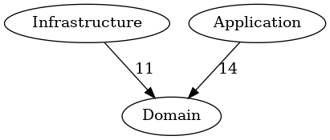

# Warehouse
A warehouse management application

- Hexagonal Architecture / Onion Architecture
- Framework agnostic
- Dependency Rule: dependency goes inwards

## Folder structure
```
bin/ - application binaries
src/
├─ Core/ - the application core
│  ├─ Application/ - API
│  ├─ Domain/ - the business logic
├─ Infrastructure/ - the adapters for the infrastructure tools
```

## Dependencies


## Conventions
- https://symfony.com/doc/current/contributing/code/standards.html
- https://matthiasnoback.nl/2020/06/unit-test-naming-conventions/
